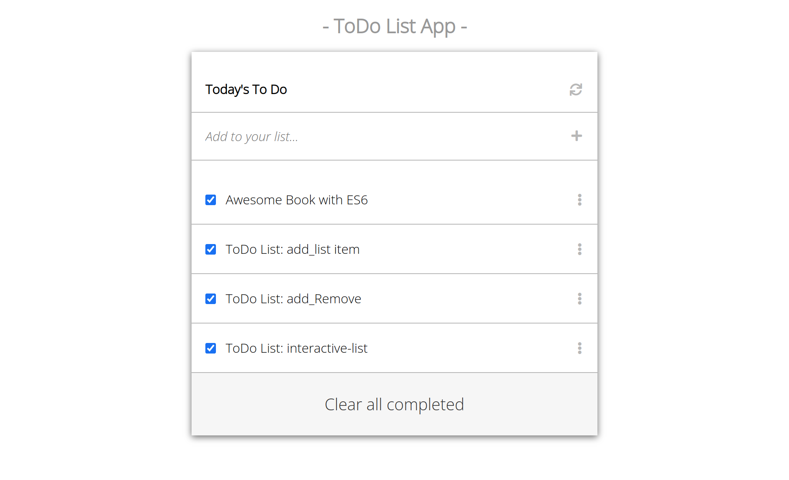

# To-Do-List

A To-Do-List App helps users to get their task cordinated and organised.

  

This  project is from microverse javascript curriculum which tests student's ability on using webpack in a real life project.

## Built With

- HTML
- CSS
- JAVASCRIPT
- Webpack

## Live Demo Link

[Live Demo](https://zieeco.github.io/To-Do-List/)

## Getting Started

To get a local copy up and running:

1. Clone this repository or download the Zip folder:

**`https://github.com/zieeco/To-Do-List.git`**

1. Navigate to the location of the folder in your machine:

**`you@your-Pc-name:~$ cd <folder>`**

## Author

👤 **zieeco**

- Github: [@zieeco](https://github.com/zieeco)

- LinkedIn: [Isaac Imaobong Samuel](https://www.linkedin.com/in/isaac-imaobong-samuel-a4849b1b8/)

## Credits

Lesson by [Microverse](https://bit.ly/MicroverseTN)

## Contributing

Contributions, issues, and feature requests are welcome!

## Show your support

Give a ⭐️ if you like this project and how we manage to build it!

## 📝 License

This project is [MIT](./MIT.md) licensed